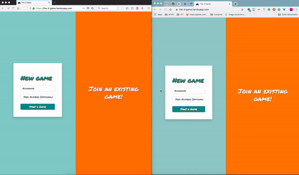

# The 3 Game

## Goal

The Goal is to implement a game with two independent units – the players – communicating with each other using an API.

### Description

When a player starts, it incepts a random (whole) number and sends it to the second player as an approach of starting the game.
The receiving player can now always choose between adding one of {­1, 0, 1} to get to a number that is divisible by 3. Divide it by three. The resulting whole number is then sent back to the original sender.
The same rules are applied until one player reaches the number 1(after the division).

### Live Demo

- [Demo](https://the-3-game.herokuapp.com/)





---

## Web Sockets Available

- new-game
- join-game
- round

---

## Installation

```
# Step 1. Install Node JS dependencies
$ npm install
```

### Development

```
$ npm run start-dev
```

### Testing

Explanation to how to prepare the environment for automated tests for this APIs.

#### Unit Test & Acceptance test

```
npm test
```

#### Test Coverage

```
npm run coverage
```

````
--------------------------|----------|----------|----------|----------|-------------------|
File                      |  % Stmts | % Branch |  % Funcs |  % Lines | Uncovered Line #s |
--------------------------|----------|----------|----------|----------|-------------------|
All files                 |      100 |    97.22 |      100 |      100 |                   |
 API/use_cases            |      100 |       95 |      100 |      100 |                   |
  create_game.js          |      100 |      100 |      100 |      100 |                   |
  games_list.js           |      100 |      100 |      100 |      100 |                   |
  join_game.js            |      100 |      100 |      100 |      100 |                   |
  remove_games.js         |      100 |      100 |      100 |      100 |                   |
  round.js                |      100 |       90 |      100 |      100 |                15 |
 domain/entities          |      100 |      100 |      100 |      100 |                   |
  game.js                 |      100 |      100 |      100 |      100 |                   |
 domain/entities/children |      100 |      100 |      100 |      100 |                   |
  round.js                |      100 |      100 |      100 |      100 |                   |
 domain/entities/values   |      100 |      100 |      100 |      100 |                   |
  seed.js                 |      100 |      100 |      100 |      100 |                   |
 domain/repositories      |      100 |      100 |      100 |      100 |                   |
  games.js                |      100 |      100 |      100 |      100 |                   |
--------------------------|----------|----------|----------|----------|-------------------|
````

#### And coding styles test

```
npm run lint
```

## Deployment

Local deployment or external manager deployment

```
$ npm start
```

Deploy in Heroku

[](https://heroku.com/deploy?template=https://github.com/atellezsazo/The-Three-Game)

---

## Built With 

- [Node JS](https://nodejs.org/en/)
- [Socket IO](https://socket.io/)
- [Express JS](https://expressjs.com/)


## Authors

- Abner Tellez - Initial work - [Github Profile](https://www.github.com/atellezsazo/)
